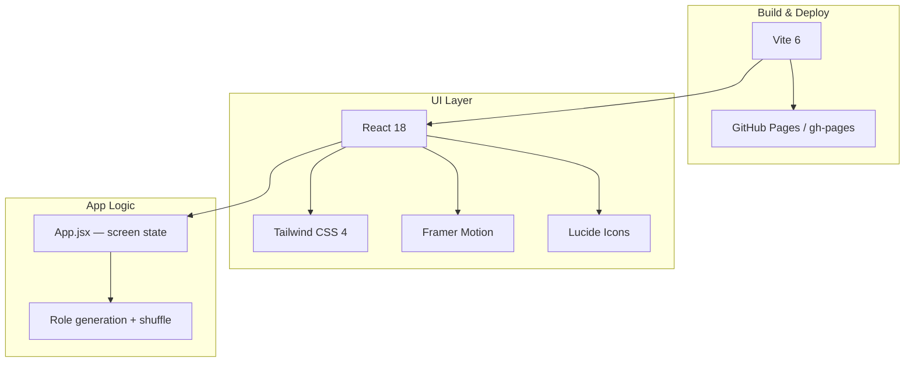
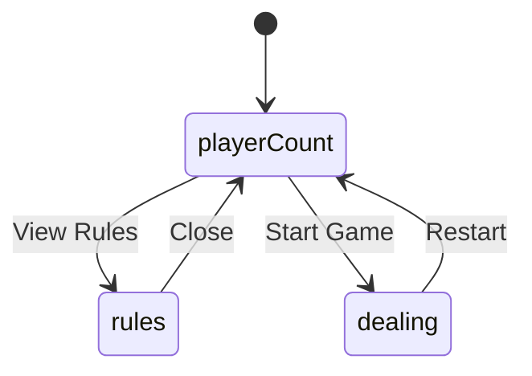
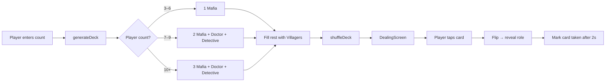
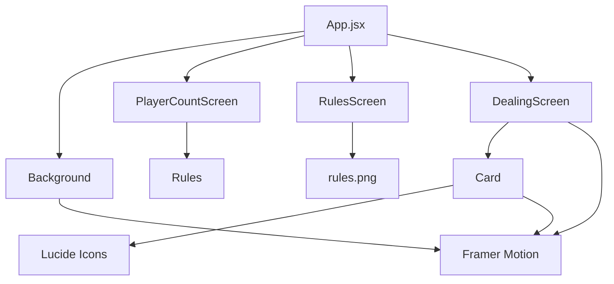
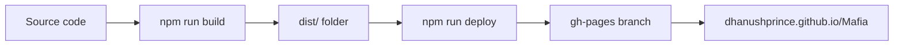
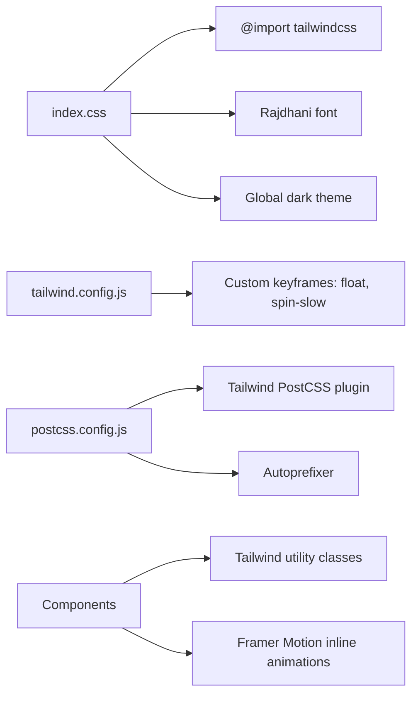

# Mafia Card Dealer — Stack & Architecture

A frontend-only single-page app for dealing Mafia role cards. No backend, database, or API.

---

## High-Level Architecture



---

## Tech Stack

| Layer | Tech | Role |
|-------|------|------|
| **Framework** | React 18 | UI components and state |
| **Bundler / dev server** | Vite 6 | Fast dev, production builds |
| **Language** | JavaScript (JSX) | No TypeScript |
| **Styling** | Tailwind CSS 4 | Utility classes (`flex`, `text-white`, etc.) |
| **CSS pipeline** | PostCSS + Autoprefixer | Processes Tailwind |
| **Animations** | Framer Motion | Card flips, fades, particles, 3D tilt |
| **Icons** | Lucide React | Skull, User, Search, etc. |
| **Font** | Rajdhani (Google Fonts) | Loaded in `index.css` |
| **Hosting** | GitHub Pages | Static site from `gh-pages` branch |

---

## Project Structure

```
Mafia/
├── index.html              # Entry HTML, mounts React at #root
├── vite.config.js          # Vite config, base path /Mafia/
├── package.json            # Dependencies & scripts
├── tailwind.config.js      # Custom animations (float, spin-slow)
├── postcss.config.js       # Tailwind + autoprefixer
├── rules.png               # Rules image asset
└── src/
    ├── main.jsx            # React entry point
    ├── index.css           # Tailwind import + global styles
    ├── App.jsx             # Main app logic & screen routing
    └── components/
        ├── PlayerCountScreen.jsx   # Pick player count
        ├── DealingScreen.jsx       # Card grid & dealing
        ├── Card.jsx                # Individual role card
        ├── RulesScreen.jsx         # Full-screen rules image
        ├── Rules.jsx               # Detailed rules UI
        ├── Background.jsx          # Animated nebula/particles
        ├── EndScreen.jsx           # End game screen
        └── WarpTransition.jsx      # Transition effect
```

---

## Screen Flow

Manual routing via React state — no React Router.



---

## Game Logic Flow



### Role assignment rules

| Players | Roles |
|---------|-------|
| 3–6 | 1 Mafia + Villagers |
| 7–9 | 2 Mafia + Doctor + Detective + Villagers |
| 10+ | 3 Mafia + Doctor + Detective + Villagers |

---

## Component Dependencies



---

## Build & Deploy Pipeline



### Commands

| Command | What it does |
|---------|--------------|
| `npm run dev` | Vite dev server → `localhost:5173` |
| `npm run build` | Production build → `dist/` |
| `npm run preview` | Preview production build locally |
| `npm run deploy` | Build + push `dist/` to `gh-pages` |

### GitHub Pages config

- `vite.config.js` → `base: '/Mafia/'` (asset paths for subpath hosting)
- `package.json` → `homepage: https://DhanushPrince.github.io/Mafia`

---

## Styling Architecture



---

## What Is NOT in the Stack

| Not used | Notes |
|----------|-------|
| TypeScript | Plain `.jsx` files |
| React Router | Manual `screen` state in `App.jsx` |
| Redux / Zustand | Local `useState` only |
| Backend / API | Fully static client-side app |
| Database | No data persistence |
| Testing framework | No Jest/Vitest setup |
| CSS-in-JS | Tailwind utility classes instead |

---

## Mental Model

1. **Vite** — builds and serves the app
2. **React** — UI and game state
3. **Tailwind** — look and layout
4. **Framer Motion** — motion and polish
5. **GitHub Pages** — hosts the built static files

This is a **pass-the-phone Mafia card dealer**, not a multiplayer online game.
